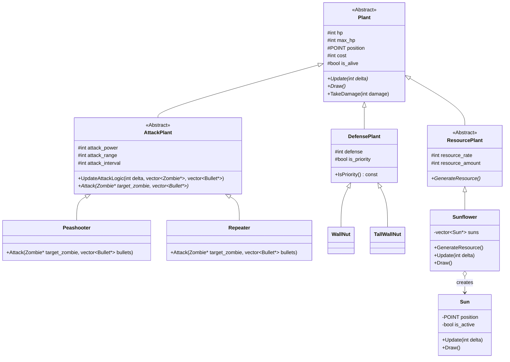

# 设计说明书

蒋思源 2023013014

设计书中主要包括1.游戏中每个类的设计；2. 软件结构； 3. 要技术难点和及实现方案

## 2.1 类的设计

程序中涉及23个类，分别是

- Animation：用于处理动画效果。
- Atlas：用于管理图像图集。
- Plant：植物的基类。
- AttackPlant：攻击型植物的基类，继承自 Plant。
- DefensePlant：防御型植物的基类（WallNut 和 TallWallNut 从此类继承）。
- ResourcePlant：资源型植物类
- Sunflower：向日葵类，继承自ResourcePlant
- Peashooter：豌豆射手类，继承自 AttackPlant。
- Repeater：双发射手类，继承自 AttackPlant。
- WallNut：坚果墙类，继承自 DefensePlant。
- TallWallNut：高坚果类，继承自 DefensePlant。
- Sun类：阳光类
- tombstone：墓碑类
- BrainBase：大脑基地类
- Zombie：僵尸类 
- NormalZombie：普通僵尸类
- EliteZombie：精英僵尸类
- ArmoredZombie：防具僵尸类
- ConeZombie：路障僵尸
- BucketZombie：铁桶僵尸
- ZombieSpawner：僵尸生成器类 
- tombstone：墓碑类
- BrainBase：大脑基地类

这是整体的UML图。


在整个游戏系统中，**动画模块（Atlas 和 Animation 类）**负责实现动画播放。Atlas 为静态图像帧（IMAGE 对象）的聚合库，为动画提供原始素材。而 Animation 类通过持有 Atlas 引用，并内置计时器与帧索引逻辑，将这些静态帧序列形成动态效果，为游戏中的动态实体（如植物、僵尸、太阳及部分子弹）提供动画支持。

**植物系统**是玩法核心之一，所有植物均派生自抽象基类 **Plant**。Plant 统一了生命值、位置等基本属性和更新、绘制等行为接口，并**聚合**一个 Animation 对象负责其视觉表现。根据功能，Plant 进一步分化：**AttackPlant（攻击型植物）** 在其更新逻辑中负责索敌并调用抽象的 `Attack` 方法。具体的攻击行为由其派生类实现，例如 `Peashooter`（豌豆射手）和 `Repeater`（双发射手）分别创建一颗或两颗 **NormalBullet**。**DefensePlant（防御型植物）** 如 `WallNut`（坚果墙）和 `TallWallNut`（高坚果），则用于承受伤害，具有高生命值和高受攻击优先级。**ResourcePlant（资源型植物）**  `Sunflower`（向日葵），负责产生游戏内经济资源（阳光），它会创建并管理多个 **Sun（太阳）** 对象；每个 Sun 对象同样拥有独立的 Animation 和飞向收集点的逻辑。

**僵尸系统**构成玩家敌人，其所有类型均派生自基类 **Zombie**。Zombie 定义了移动、攻击AI（通过 `FindNearestTarget` 方法锁定最近的 Plant 或最终目标 BrainBase）以及受击逻辑，并**聚合**一个基础 Animation 对象。基础僵尸类型包括 `NormalZombie`（普通僵尸）和 `EliteZombie`（精英僵尸）。作为中间层的 **ArmoredZombie（带护甲僵尸）** 为派生类（如 `ConeZombie` 路障僵尸和 `BucketZombie` 铁桶僵尸）引入了护甲机制，并**聚合** 额外的 Animation 对象来表现其带护甲状态。僵尸的生成由专门的 **ZombieSpawner（僵尸生成器）** 类统一管理，它依据游戏进程，从 **tombstone（墓碑）** 的指定位置创建不同类型的僵尸实例。

**子弹系统**作为攻击型植物的主要伤害输出手段，其基类 **Bullet** 定义了飞行逻辑和伤害属性（预留了动画接口）。具体的 **NormalBullet（普通子弹）** 在绘制时选择**直接使用**一个静态的 Atlas 图像资源，而非依赖 Animation 对象，这展示了基类接口的灵活性。在游戏主循环逻辑（如 `main.cpp`）中，子弹与僵尸的**碰撞检测**是关键交互，命中后会调用僵尸的 `TakeDamage` 方法施加伤害。

**关键设施类**定义了场景中的静态战略元素。**BrainBase（大脑基地）** 是玩家必须誓死保卫的终极目标，其存亡直接决定游戏胜负，也是僵尸的最终攻击目标，它使用静态 Atlas 图像表现。**Tombstone（墓碑）** 则作为僵尸的出生点，其位置信息被 ZombieSpawner 用于实例化僵尸，同样使用静态 Atlas 图像。

下面我将按照继承关系进行分类说明：

### 2.1.1 动画类


#### **`Atlas` 类 (图像资源集)**

由于我使用Easy X库进行开发，但该库并没有可以加载gif文件的函数，因此只能通过不断调用绘图函数，才能实现动画效果。**`Atlas` 类就是一个图集资源管理器，负责加载并存储游戏对  象动画所需的所有图像帧**。它的核心用途是将一个动画序列（例如，一个角色走路的所有分解动作图片）一次性加载到内存中，供 `Animation` （动画播放类类）使用，避免在游戏循环中频繁地进行文件I/O操作，提高运行效率。

##### **数据成员说明**

- `std::vector<IMAGE*> frame_list`

  - **存储内容**: 一个存储 `IMAGE` 类型指针的动态数组。
  - **数据含义**: 向量中的每一个 `IMAGE*` 都指向一张从文件中加载的图片，这张图片代表了动画的一个帧。
  - **用途**: 作为图像帧的集合，保存了一个完整动画序列所需的所有图片资源。`Animation` 类会按顺序访问这个向量来播放动画。

  ------

  

##### **函数成员说明**

- **构造函数 `Atlas(LPCTSTR path, int num)`**

  - **函数原型**: `Atlas(LPCTSTR path, int num);`
  - **详细说明**: 这是为**序列帧动画**设计的构造函数。需要调用的图片都被命名为了有规律的格式。Atlas它接受一个格式化的文件路径字符串（如 `_T("img/player_left_%d.png")`）和一个帧数量 `num`。函数会通过循环，使用 `_stprintf_s` 函数生成每一帧的完整路径（例如，"img/player_left_0.png", "img/player_left_1.png", ...），然后加载这些图片，并将指向它们的 `IMAGE` 指针存入 `frame_list` 中。

  > [!CAUTION]
  >
  > IMAGE类为Easy X库自带类，配合loadimage()可实现绘图
  >
  > ``` c++
  > // 使用方法
  > void loadimage(
  >     IMAGE* pDstImg,          // 目标 IMAGE 对象指针
  >     LPCTSTR pImgFile,        // 图片文件名
  >     int nWidth = 0,          // 缩放后的宽度（0 表示保持原尺寸）
  >     int nHeight = 0,         // 缩放后的高度
  >     bool bResize = false     // 是否调整 IMAGE 对象尺寸以适应图片
  > );
  > ```
  >
  > 

  - **主要功能**: 加载一系列命名有规律的图片文件，构建一个完整的动画帧序列。

- **构造函数 `Atlas(LPCTSTR path)`**

  - **函数原型**: `Atlas(LPCTSTR path);`
  - **详细说明**: 这是为**单个静态图像**设计的构造函数。它只接受一个固定的文件路径，加载该图片，并将其指针存入 `frame_list` 中。
  - **主要功能**: 加载单个图片资源，适用于那些不需要动画效果的对象（如图标、背景）。

- **析构函数 `~Atlas()`**

  - **函数原型**: `~Atlas();`
  - **详细说明**: 负责释放 `Atlas` 对象所占用的资源。它会遍历 `frame_list` 向量，并 `delete` 每一个由 `new IMAGE` 创建的指针，以防止内存泄漏。
  - **主要功能**: 清理动态分配的 `IMAGE` 对象，确保内存安全。

#### **`Animation` 类 (动画播放器)**

`Animation` 类的核心用途是**控制和播放动画**。它本身不存储图像数据，而是通过持有一个 `Atlas` 对象的指针来获取图像资源。它内部维护一个计时器和帧索引，根据设定的时间间隔，循环播放 `Atlas` 中存储的图像帧，从而在屏幕上形成动态效果。

------

##### **数据成员说明**

- `Atlas* anim_atlas`
  - **存储内容**: 指向一个 `Atlas` 对象的指针。
  - **数据含义**: 关联的图像资源集。
  - **用途**: 为 `Animation` 对象提供播放所需的图像帧序列。
- `int internal`
  - **存储内容**: 一个整数。
  - **数据含义**: 动画帧与帧之间的播放间隔时间，单位为毫秒。
  - **用途**: 控制动画的播放速度。`internal` 值越小，动画播放得越快。
- `int idx_frame`
  - **存储内容**: 帧索引。
  - **数据含义**: 当前动画播放到 `anim_atlas->frame_list` 中的哪一帧的索引。
  - **用途**: 标记当前应显示的图像帧。
- `int timer`
  - **存储内容**: 一个整数。
  - **数据含义**: 计时器，用于累计自上次切换帧以来经过的时间。
  - **用途**: 当 `timer` 的值超过 `internal` 时，意味着应该切换到下一帧了。

------

##### **函数成员说明**

- **构造函数 `Animation(Atlas * atlas, int jiange)`**
  - **函数原型**: `Animation(Atlas* atlas, int jiange);`
  - **详细说明**: 初始化一个 `Animation` 对象。它接收一个 `Atlas` 指针 `atlas` 来指定要播放的动画资源，以及一个整数 `jiange`（间隔）来设定播放速度。构造函数会将这些参数分别赋值给成员变量 `anim_atlas` 和 `internal`，并初始化 `idx_frame` 和 `timer` 为0。
  - **主要功能**: 创建并设置一个动画播放器实例。
- **析构函数 `~Animation()`**
  - **函数原型**: `~Animation();`
  - **详细说明**: 在当前实现中，该析构函数是空的。因为 `Animation` 类并不拥有 `Atlas` 对象（它只持有指针），`Atlas` 对象的生命周期由外部（例如 `main` 函数或拥有 `Animation` 的对象）管理。
  - **主要功能**: 销毁 `Animation` 对象。
- **`void showimage(int x, int y, int delta)`**
  - **函数原型**: `void showimage(int x, int y, int delta);`
  - **详细说明**: 这是动画播放的核心函数。每次在游戏主循环中被调用时，它会：
    1. 将 `delta`（自上一逻辑帧所经过的时间）累加到内部计时器 `timer` 中。
    2. 检查 `timer` 是否大于或等于设定的间隔 `internal`。
    3. 如果是，则将帧索引 `idx_frame` 加一（并使用取模运算 `%` 来实现循环播放），然后将 `timer` 重置为0。
    4. 最后，根据计算出的 `idx_frame`，从 `anim_atlas` 中获取对应的 `IMAGE` 指针，并调用 `putimage_alpha` 函数在屏幕的 `(x, y)` 坐标处绘制出当前帧的图像。
  - **主要功能**: 更新动画帧并将其绘制到屏幕上。

### 2.1.2 Plant类及其派生类

#### `Plant` 类 (植物基类)

`Plant`是一个**基类**，作为游戏中所有植物的共同父类。它定义了所有植物都应具备的通用属性（如生命值、位置、开销）和行为接口（如更新、绘制、承受伤害）。通过使用该基类，游戏可以在一个统一的容器中管理所有不同种类的植物，并以**多态**的方式调用它们的通用方法，极大地简化了主循环的逻辑。

#### UML图




##### 数据成员说明

- `protected int hp`
  - **存储内容**: 一个整数。
  - **数据含义**: 植物当前的生命值。
  - **用途**: 当该值降至0或以下时，植物被视为死亡。
- `protected int max_hp`
  - **存储内容**: 一个整数。
  - **数据含义**: 植物的最大生命值。
  - **用途**: 用于在界面上绘制血条的百分比，以及在接受强化时提升生命值上限。
- `protected POINT position`
  - **存储内容**: 一个`POINT`结构体，包含x和y坐标。
  - **数据含义**: 植物在游戏世界中的精确位置。
  - **用途**: 用于确定植物的绘制位置、攻击索敌的起点以及碰撞检测。
- `protected int cost`
  - **存储内容**: 一个整数。
  - **数据含义**: 种植该植物需要消耗的“太阳”资源数量。
  - **用途**: 在种植植物前检查玩家是否有足够的资源。
- `protected Animation* anim`
  - **存储内容**: 指向`Animation`对象的指针。
  - **数据含义**: 与该植物关联的动画播放器。
  - **用途**: 负责管理和显示植物的动态图像。
- `protected bool is_alive`
  - **存储内容**: 一个布尔值。
  - **数据含义**: 标记植物当前是否存活。
  - **用途**: 游戏逻辑通过此标志来判断植物是否应继续更新、绘制或可以从游戏中移除。

##### 函数成员说明

- **构造函数 `Plant(int init_hp, POINT pos, int init_cost, Atlas\* atlas, int frame_interval)`**
  - **函数原型**: `Plant(int init_hp, POINT pos, int init_cost, Atlas* atlas, int frame_interval);`
  - **详细说明**: 初始化一个植物对象。它接收初始生命值、位置、开销、指向图像集`Atlas`的指针以及动画帧间隔作为参数，并用这些参数设置相应的成员变量，同时创建一个新的`Animation`对象。
  - **主要功能**: 创建并初始化一个植物实例。
- **析构函数 `virtual ~Plant()`**
  - **函数原型**: `virtual ~Plant();`
  - **详细说明**: 销毁植物对象时，它会负责`delete`由构造函数动态创建的`Animation`对象，以防止内存泄漏。
  - **主要功能**: 释放资源。
- **`virtual void Update(int delta) = 0`**
  - **函数原型**: `virtual void Update(int delta) = 0;`
  - **详细说明**: 这是一个**纯虚函数**，定义了所有植物的更新逻辑接口。`delta`是自上一帧以来经过的时间。此函数必须由所有具体的派生类实现，以定义它们每帧的行为。
  - **主要功能**: 为所有派生类提供一个统一的逻辑更新入口。
- **`virtual void Draw()`**
  - **函数原型**: `virtual void Draw();`
  - **详细说明**: 负责在屏幕上绘制植物。如果植物存活，它会调用其`Animation`对象的`showimage`方法来显示当前动画帧，并根据当前生命值与最大生命值的比例绘制一个血条。
  - **主要功能**: 可视化植物。
- **`virtual void TakeDamage(int damage)`**
  - **函数原型**: `virtual void TakeDamage(int damage);`
  - **详细说明**: 处理植物受到伤害的逻辑。它会从当前`hp`中减去伤害值，如果`hp`降至0或以下，则将`is_alive`标志设为`false`。
  - **主要功能**: 减少植物生命值。
- **`void IncreaseMaxHPAndHeal(int amount)`**
  - **函数原型**: `void IncreaseMaxHPAndHeal(int amount);`
  - **详细说明**: 用于实现回合结束时的强化。它会增加植物的`max_hp`和`hp`，并确保当前生命值不会超过新的最大生命值。
  - **主要功能**: 提升植物的生存能力。

------

#### `AttackPlant` 类 (攻击型植物)

`AttackPlant` 继承自 `Plant`，是所有能够主动攻击僵尸的植物的基类。它在 `Plant` 的基础上增加了攻击相关的属性和行为接口。

##### 数据成员说明

- `protected int attack_power`
  - **存储内容**: 一个整数。
  - **数据含义**: 植物的攻击力。
  - **用途**: 决定其发射的子弹所造成的伤害值。
- `protected int attack_range`
  - **存储内容**: 一个整数。
  - **数据含义**: 植物的攻击范围，单位为像素。
  - **用途**: 在索敌时判断僵尸是否进入了可攻击的距离。
- `protected int attack_interval`
  - **存储内容**: 一个整数。
  - **数据含义**: 两次攻击之间的最小时间间隔，单位为毫秒。
  - **用途**: 控制植物的攻击频率（射速）。
- `protected int attack_timer`
  - **存储内容**: 一个整数。
  - **数据含义**: 攻击计时器。
  - **用途**: 从上一次攻击后开始累计时间，当达到`attack_interval`时触发下一次攻击。

##### 函数成员说明

- **`void UpdateAttackLogic(int delta, std::vector<Zombie\*>& zombies, std::vector<Bullet\*>& bullets)`**
  - **函数原型**: `void UpdateAttackLogic(int delta, std::vector<Zombie*>& zombies, std::vector<Bullet*>& bullets);`
  - **详细说明**: 这是攻击植物的核心AI逻辑。它每帧更新攻击计时器，当计时器满足攻击间隔时，它会遍历`zombies`容器，在`attack_range`内寻找最近的存活僵尸作为目标。如果找到目标，就调用`Attack`方法发起攻击，并重置计时器。
  - **主要功能**: 实现自动索敌和攻击循环。
- **`virtual void Attack(Zombie\* target_zombie, std::vector<Bullet\*>& bullets) = 0`**
  - **函数原型**: `virtual void Attack(Zombie* target_zombie, std::vector<Bullet*>& bullets) = 0;`
  - **详细说明**: 纯虚函数，定义了具体的攻击行为。它必须由派生类（如`Peashooter`）实现，负责创建一颗或多颗`Bullet`对象，并将其添加到全局的`bullets`容器中。
  - **主要功能**: 执行攻击动作（如发射子弹）。
- **`void IncreaseAttackPower(int amount)`**
  - **函数原型**: `void IncreaseAttackPower(int amount);`
  - **主要功能**: 增加植物的`attack_power`，用于回合结束时的强化。

------

#### `DefensePlant` 类 (防御型植物)

`DefensePlant` 继承自 `Plant`，是所有起阻挡和吸收伤害作用的植物的基类。

##### 数据成员说明

- `protected int defense`
  - **存储内容**: 一个整数。
  - **数据含义**: 植物的防御力。
  - **用途**: 在`TakeDamage`中减免受到的部分伤害。
- `protected bool is_priority`
  - **存储内容**: 一个布尔值。
  - **数据含义**: 标记该植物是否为僵尸的优先攻击目标。
  - **用途**: 在僵尸的`FindNearestTarget`逻辑中，僵尸会优先攻击`is_priority`为`true`的植物。

##### 函数成员说明

- `void TakeDamage(int damage) override`
  - **函数原型**: `virtual void TakeDamage(int damage) override;`
  - **详细说明**: 重写了基类的`TakeDamage`方法。它会先用传入的伤害值`damage`减去自身的防御力`defense`，然后才对植物造成实际伤害。如果计算出的实际伤害小于等于0，则至少造成1点伤害。
  - **主要功能**: 实现伤害减免。

------

#### `ResourcePlant` 类 (资源型植物)

`ResourcePlant` 继承自 `Plant`，是所有能产生游戏内资源（如太阳）的植物的基类。

##### 数据成员说明

- `protected int resource_rate`
  - **存储内容**: 一个整数。
  - **数据含义**: 产生资源的频率，单位为毫秒。
  - **用途**: 控制资源产出的时间间隔。
- `protected int resource_amount`
  - **存储内容**: 一个整数。
  - **数据含义**: 一次产生的资源数量。
  - **用途**: 定义单次产出的资源值。
- `protected int resource_timer`
  - **存储内容**: 一个整数。
  - **数据含义**: 资源生成计时器。
  - **用途**: 累计时间，当达到`resource_rate`时触发资源生成。

##### 函数成员说明

- **`void Update(int delta) override`**
  - **函数原型**: `void Update(int delta) override;`
  - **详细说明**: 实现了基类的`Update`方法。它每帧更新资源计时器`resource_timer`，当计时器满足`resource_rate`时，调用`GenerateResource()`方法，并重置计时器。
  - **主要功能**: 控制资源按时产出。
- **`virtual void GenerateResource() = 0`**
  - **函数原型**: `virtual void GenerateResource() = 0;`
  - **详细说明**: 纯虚函数，定义了具体的资源生成行为，必须由派生类（如`Sunflower`）实现。
  - **主要功能**: 执行资源生成动作。

------

### 2.1.3 具体植物派生类及阳光类

​	这些类是游戏中玩家可以直接种植的、功能明确的植物单位。它们继承自 `AttackPlant`、`DefensePlant` 或 `ResourcePlant`，并为基类中定义的纯虚函数提供了具体的实现。它们的主要作用是在构造函数中为基类定义的属性（如生命值、开销、攻击力等）赋予符合自身特色的初始值。

#### `Peashooter` 类 (豌豆射手)

- **继承自**: `AttackPlant`

- **用途**: 作为游戏中最基础的远程攻击单位，`Peashooter` 以固定的频率向其攻击范围内的单个僵尸目标发射直线飞行的子弹，造成稳定伤害。

- 构造函数 `Peashooter(POINT pos)`

  - **函数原型**: `Peashooter(POINT pos);`

  - 详细说明: 调用`AttackPlant` 的构造函数，并传入一组预设值来定义自身特性：

    - `hp`: 100
    - `cost`: 100
    - `attack_power`: 20
    - `attack_range`: 500 (像素)
    - `attack_interval`: 800 (毫秒)
    - `Atlas`: 使用 `img/peashooter_%d.png` 的图像序列来创建动画。

    位置在创建时传入

- 函数成员说明

  - `void Attack(Zombie* target_zombie, std::vector<Bullet*>& bullets) override`
    - **函数原型**: `void Attack(Zombie* target_zombie, std::vector<Bullet*>& bullets);`
    - **详细说明**:这是对 `AttackPlant` 中纯虚函数 `Attack` 的具体实现。 当被 `UpdateAttackLogic` 调用时，该函数会执行以下操作：
      1. 确定子弹的发射起始位置，该位置在豌豆射手图像的“嘴部”附近有轻微的偏移 (`position.x + 19`, `position.y + 3`)。
      2. 创建一个新的 `NormalBullet` 对象，将传入目标僵尸的位置`target_zombie->GetPosition()` 作为子弹的目标点。
      3. 将新创建的子弹指针添加到全局的 `bullets` 容器中，之后主循环会负责该子弹的更新和绘制。
    - **主要功能**: 发射一颗伤害为20的普通子弹。

------

#### `Repeater` 类 (双发射手)

- **继承自**: `AttackPlant`

- **用途**: `Peashooter` 的升级版，能够在一次攻击动作中快速连续发射两颗子弹，从而在短时间内造成双倍伤害，是重要的火力输出单位。

- 构造函数 `Repeater(POINT pos)`

  - **函数原型**: `Repeater(POINT pos);`

  - 详细说明 ：调用 `AttackPlant` 的构造函数并传入以下预设值

     的构造函数并传入以下预设值：

    - `hp`: 100
    - `cost`: 200
    - `attack_power`: 20 (每颗子弹)
    - `attack_range`: 500
    - `attack_interval`: 800
    - `Atlas`: 使用 `img/repeater_%d.png` 的图像序列。

- 函数成员说明

  - `void Attack(Zombie* target_zombie, std::vector<Bullet*>& bullets) override`
    - **函数原型**: `void Attack(Zombie* target_zombie, std::vector<Bullet*>& bullets);`
    - **详细说明**: 对 `Attack` 接口的实现。与 `Peashooter` 不同，此函数会**连续执行两次**子弹创建和添加操作：
      1. 创建第一颗 `NormalBullet` 对象，从一个发射点 (`position.x + 19`) 发射。
      2. 立即创建第二颗 `NormalBullet` 对象，为了视觉效果，它从一个略微不同的发射点 (`position.x + 0`) 发射。
      3. 将这两颗子弹都添加到全局 `bullets` 容器中。
    - **主要功能**: 发射两颗伤害均为20的普通子弹，实现“连发”效果。

------

#### `WallNut` 类 (坚果墙)

- **继承自**: `DefensePlant`
- **用途**: 游戏中的核心防御单位。它本身没有攻击能力，但拥有极高的生命值，专门用于阻挡僵尸前进的道路，为后方的攻击型植物争取输出时间。
- 构造函数 `WallNut(POINT pos)`
  - **函数原型**: `WallNut(POINT pos);`
  - 详细说明：调用 `DefensePlant` 的构造函数并传入以下预设值：
    - `hp`: 400
    - `cost`: 50
    - `defense`: 20 (在 `TakeDamage` 中减免伤害)
    - `is_priority`: `true`。告诉僵尸优先攻击坚果墙，从而保护其他更脆弱的植物。
    - `Atlas`: 使用 `img/wallnut_%d.png` 的图像序列。
- **函数成员说明**: 该类没有自己独特的函数成员，它完全依赖 `DefensePlant` 和 `Plant` 基类提供的功能（如被重写的 `TakeDamage` 和 `Draw`）。

------

#### `TallWallNut` 类 (高坚果)

- **继承自**: `DefensePlant`
- **用途**: `WallNut` 的超级强化版，拥有比坚果墙高得多的生命值，能够更持久地抵御僵尸的猛烈攻击，是后期防线的关键支柱。
- 构造函数 `TallWallNut(POINT pos)`
  - **函数原型**: `TallWallNut(POINT pos);`
  - 详细说明：调用 `DefensePlant` 的构造函数并传入以下预设值：
    - `hp`: 1000
    - `cost`: 125
    - `defense`: 20
    - `is_priority`: `true`
    - `Atlas`: 使用 `img/TallWallNut_%d.png` 的图像序列。
- **函数成员说明**: 与 `WallNut` 类似，该类也完全依赖其基类提供的功能。

------

#### `Sun` 类 (太阳资源)

​	`Sun` 类代表了游戏中的可收集资源单位。它本身是一个独立的游戏对象，由向日葵（`Sunflower`）创建出来。它的核心用途是作为一个可视化的、动态的资源实体，从生成点（向日葵的位置）移动到屏幕上的固定收集点。当它到达目的地时，它会为玩家增加“太阳”点数，并从游戏中消失。

##### 数据成员说明

- `private POINT position`
  - **存储内容**: 一个 `POINT` 结构体，包含x和y坐标。
  - **数据含义**: 太阳在屏幕上的当前实时位置。
  - **用途**: 用于更新太阳的位置和在屏幕上绘制太阳。
- `private POINT target`
  - **存储内容**: 一个 `POINT` 结构体，包含x和y坐标。
  - **数据含义**: 太阳要移动到的目标位置。 在代码中，这个位置被硬编码为屏幕左上角的一个固定点 `{ 10, 10 }`。
  - **用途**: 在 `Update` 函数中计算太阳移动的方向和距离。
- `private Animation* anim`
  - **存储内容**: 指向 `Animation` 对象的指针。
  - **数据含义**: 与太阳关联的动画播放器。
  - **用途**: 负责管理和显示太阳旋转、闪光的动态图像。
- `private bool is_active`
  - **存储内容**: 一个布尔值。
  - **数据含义**: 标记太阳是否处于“活动”状态。
  - **用途**: `true` 表示太阳正在飞向收集点，是可见且可更新的。当太阳到达目的地后，此值变为 `false`，表示它已被收集，可以从游戏中清除了。
- `private const double MOVE_SPEED`
  - **存储内容**: 一个 `double` 类型的常量。
  - **数据含义**: 太阳向目标点移动的速度。
  - **用途**: 在 `Update` 函数中计算太阳每帧移动的距离。

##### 函数成员说明

- **构造函数 `Sun(POINT pos, Atlas\* atlas)`**
  - **函数原型**: `Sun(POINT pos, Atlas* atlas);`
  - **详细说明**: 初始化一个 `Sun` 对象。它接收一个 `POINT pos` 作为初始生成位置，以及一个 `Atlas` 指针来创建自身的动画。构造函数会设置初始位置、目标点（固定为 `{10, 10}`），并将 `is_active` 设为 `true`。
  - **主要功能**: 创建一个准备飞向收集点的太阳实例。
- **析构函数 `~Sun()`**
  - **函数原型**: `~Sun();`
  - **详细说明**: 销毁 `Sun` 对象时，它会负责 `delete` 由构造函数动态创建的 `Animation` 对象，以防止内存泄漏。
  - **主要功能**: 释放资源。
- **`void Update(int delta)`**
  - **函数原型**: `void Update(int delta);`
  - 详细说明: 这是太阳对象的核心逻辑。每一帧被调用时，它会：
    1. 计算当前位置与目标位置之间的距离。
    2. 如果距离小于移动速度 `MOVE_SPEED`，意味着太阳已到达或非常接近目的地。此时，它会将 `is_active` 设为 `false`，并为全局变量 `sun_count` 增加25点。
    3. 如果距离较远，它会计算出朝向目标点的单位方向向量，并沿着该方向移动 `MOVE_SPEED` 的距离。
  - **主要功能**: 更新太阳的位置，并在其到达目标时增加玩家资源。
- **`void Draw()`**
  - **函数原型**: `void Draw();`
  - **详细说明**: 如果太阳是活动的（`is_active` 为 `true`），此函数会调用其 `Animation` 对象的 `showimage` 方法，在当前 `position` 处绘制太阳的动画帧。
  - **主要功能**: 在屏幕上显示太阳。
- **`bool IsActive() const`**
  - **函数原型**: `bool IsActive() const;`
  - **详细说明**: 这是一个 `const` 成员函数，它返回 `is_active` 成员变量的当前值。
  - **主要功能**: 供外部（如 `Sunflower` 类的 `Update` 函数）查询太阳是否已被收集，以便将其从管理容器中安全地移除。

#### `Sunflower` 类 (向日葵)

- **继承自**: `ResourcePlant`

- **用途**: 游戏中唯一的经济来源植物。它不能攻击或防御，其唯一的功能就是周期性地生产“太阳”资源，供玩家种植其他植物。

- 构造函数 `Sunflower(POINT pos)`

  - **函数原型**: `Sunflower(POINT pos);`
  - 详细说明：调用 `ResourcePlant` 的构造函数并传入以下预设值：
    - `hp`: 100
    - `cost`: 50
    - `resource_rate`: 20000 (毫秒，即20秒)
    - `resource_amount`: 25 (每次产出25个太阳)
    - `Atlas`: 使用 `img/sunflower_%d.png` 的图像序列。
    - 同时，它会检查并加载所有 `Sun` 对象共享的静态 `sun_atlas` 资源。

- 数据成员说明

  - ```
    private: std::vector<Sun*> suns
    ```

    - **存储内容**: 一个存储 `Sun` 对象指针的动态数组。
    - **用途**: 用于管理由**这株向日葵**产生的所有 `Sun` 对象。这使得每株向日葵都可以独立地跟踪和更新自己产生的太阳，直到它们被收集。

- 函数成员说明

  - `void GenerateResource() override`
    - **函数原型**: `void GenerateResource();`
    - **详细说明**: 这是对 `ResourcePlant` 中 `GenerateResource` 纯虚函数的实现。 当被 `Update` 逻辑触发时，它会在向日葵附近的位置创建一个新的 `Sun` 对象，并将其指针添加到 `suns` 向量中。
    - **主要功能**: 生产一个可收集的太阳。
  - `void Update(int delta) override`
    - **函数原型**: `void Update(int delta);`
    - **详细说明**: 重写了 `ResourcePlant` 的 `Update`。除了调用基类的 `Update` (用于按时触发 `GenerateResource`)，它还负责遍历 `suns` 向量，调用每个 `Sun` 对象的 `Update` 方法（使其移动），并使用 `std::remove_if` 清理那些已经被收集（`IsActive()` 返回 `false`）的 `Sun` 对象。
    - **主要功能**: 管理自身资源生产循环以及所生产出的太阳的生命周期。
  - `void Draw() override`
    - **函数原型**: `void Draw();`
    - **详细说明**: 重写了 `Plant` 的 `Draw`。除了调用基类的 `Draw` 来绘制向日葵自身，它还会遍历 `suns` 向量，调用每个 `Sun` 对象的 `Draw` 方法，从而将所有未被收集的太阳绘制在屏幕上。
    - **主要功能**: 绘制向日葵和它产生的所有太阳。

### 2.1.3 僵尸类及其派生类

#### UML图


#### `Zombie` 类 (僵尸基类)

`Zombie` 是一个基类，定义了游戏中所有敌方单位（僵尸）的共同特征和行为。它封装了僵尸的生命周期管理、移动逻辑、攻击行为以及核心的AI索敌算法。作为基类，它同样支持通过多态来统一管理不同种类的僵尸。

##### 数据成员说明

- `protected Animation* anim`
  - **存储内容**: 指向`Animation`对象的指针。
  - **数据含义**: 与该僵尸关联的动画播放器。
  - **用途**: 控制僵尸的行走、攻击等动画的显示。
- `protected int hp`, `protected int max_hp`
  - **存储内容**: 两个整数。
  - **数据含义**: 僵尸的当前生命值和最大生命值。
  - **用途**: 用于处理伤害计算和绘制血条。当`hp`降至0或以下，僵尸死亡。
- `protected int attack_power`
  - **存储内容**: 一个整数。
  - **数据含义**: 僵尸的攻击力。
  - **用途**: 在攻击植物或基地时，决定造成的伤害值。
- `protected POINT position`
  - **存储内容**: 一个`POINT`结构体。
  - **数据含义**: 僵尸在屏幕上的当前坐标。
  - **用途**: 用于绘制和攻击被攻击逻辑判断。
- `protected POINT target_position`
  - **存储内容**: 一个`POINT`结构体。
  - **数据含义**: 僵尸当前要移动到的目标位置。
  - **用途**: `Update`函数根据此位置来计算移动方向。
- `protected double speed`
  - **存储内容**: 一个`double`类型的值。
  - **数据含义**: 僵尸的移动速度，单位为像素/单位时间。
  - **用途**: 控制僵尸在`Update`函数中每帧移动的距离。
- `protected bool is_alive`
  - **存储内容**: 一个布尔值。
  - **数据含义**: 标记僵尸是否存活。
  - **用途**: `false`表示僵尸已死亡，可以从游戏中移除。
- `protected Plant* target_plant`, `protected BrainBase* target_brain`
  - **存储内容**: 分别指向`Plant`和`BrainBase`对象的指针。
  - **数据含义**: 僵尸当前锁定的攻击目标。
  - **用途**: `FindNearestTarget`函数会设置这些指针，`Update`函数则根据它们来执行攻击。

##### 函数成员说明

- **构造函数 `Zombie(...)`**

  - **函数原型**: `Zombie(int init_hp, int init_attack_power, POINT init_pos, double init_speed, int atk_interval);`
  - **详细说明**: 初始化一个僵尸对象，设置其生命值、攻击力、初始位置、速度和攻击间隔等基本属性。
  - **主要功能**: 创建一个僵尸实例。

- **析构函数 `virtual ~Zombie()`**

  - **函数原型**: `virtual ~Zombie();`
  - **详细说明**: 销毁僵尸对象时，它会负责`delete`由构造函数动态创建的`Animation`对象。
  - **主要功能**: 释放资源，防止内存泄漏。

- **`virtual void Update(int delta, const std::vector<Plant\*>& plants, BrainBase\* brain)`**

  - **函数原型**: `virtual void Update(int delta, const std::vector<Plant*>& plants, BrainBase* brain);`

  - 详细说明

    : 这是僵尸的核心逻辑。每一帧被调用时，它会：

    1. 调用`FindNearestTarget`来实时更新攻击目标。
    2. 计算与目标的距离。如果距离足够近（在攻击范围内），则执行攻击逻辑。
    3. 如果距离较远，则计算朝向目标的方向，并根据`speed`移动自身位置。

  - **主要功能**: 更新僵尸的位置和攻击状态。

- **`void FindNearestTarget(const std::vector<Plant\*>& plants, BrainBase\* brain)`**

  - **函数原型**: `void FindNearestTarget(const std::vector<Plant*>& plants, BrainBase* brain);`
  - **详细说明**: 实现僵尸的AI索敌算法。它会优先寻找被标记为高优先级的防御植物，其次是范围内最近的其他植物，如果没有任何植物，则将目标设为大脑基地。
  - **主要功能**: 为僵尸决策攻击目标。

- **`virtual void TakeDamage(int damage)`**

  - **函数原型**: `virtual void TakeDamage(int damage);`
  - **详细说明**: 虚函数，处理僵尸受到伤害的逻辑。它会从`hp`中减去伤害值，并在`hp`小于等于0时将`is_alive`设为`false`。
  - **主要功能**: 减少僵尸生命值。

- **`virtual void Draw()`**

  - **函数原型**: `virtual void Draw();`
  - **详细说明**: 负责在屏幕上绘制僵尸。如果僵尸存活，它会调用`Animation`对象的`showimage`方法显示动画，并根据当前`hp`和`max_hp`绘制血条。
  - **主要功能**: 可视化僵尸。

- **`static void LoadResources()` / `static void UnloadResources()`**

  **函数原型**: `static void LoadResources();` / `static void UnloadResources();`

  **详细说明**: 这是一对静态函数，用于管理所有僵尸共享的图像资源（`Atlas`）。`LoadResources`在游戏开始时被调用一次，加载所有僵尸类型的图片。`UnloadResources`在游戏结束时被调用，统一释放这些资源。

  **主要功能**: **高效且安全地管理共享资源，避免重复加载和内存泄漏。**这点对于本游戏非常重要，在设计这个函数之前，游戏运行3min左右就会内存溢出。

  #### `ArmoredZombie` 类 (盔甲僵尸)

- **继承自**: `Zombie`
- **用途**: `ArmoredZombie`是所有带护甲的僵尸的基类。它在`Zombie`的基础上增加了护甲系统，使得这类僵尸更难被消灭。

##### 数据成员说明

- `protected int armor_hp`, `protected int max_armor_hp`
  - **存储内容**: 两个整数。
  - **数据含义**: 僵尸的当前护甲值和最大护甲值。
  - **用途**: 护甲生命值，在本体生命值`hp`之前承受伤害。
- `protected bool has_armor`
  - **存储内容**: 一个布尔值。
  - **数据含义**: 标记僵尸是否仍有护甲。
  - **用途**: `true`表示护甲存在，`TakeDamage`会先扣减护甲值。当护甲值降至0，此标志变为`false`，僵尸的外观也会改变。
- `protected Animation* armor_anim`
  - **存储内容**: 指向`Animation`对象的指针。
  - **数据含义**: 僵尸在有护甲状态下使用的动画。
  - **用途**: 当`has_armor`为`true`时，`Draw`函数会使用这个动画来绘制僵尸。

##### 函数成员说明

- **`void TakeDamage(int damage) override`**
  - **函数原型**: `virtual void TakeDamage(int damage) override;`
  - **详细说明**: 重写了基类的`TakeDamage`方法。当此函数被调用时，它会检查`has_armor`标志：
    - 如果为`true`，伤害会优先作用于`armor_hp`。当`armor_hp`降至0或以下时，`has_armor`会变为`false`。
    - 如果为`false`，则调用基类的`Zombie::TakeDamage(damage)`方法，直接对本体`hp`造成伤害。
  - **主要功能**: 实现“护甲”机制，即伤害优先由护甲承受。
- **`void Draw() override`**
  - **函数原型**: `virtual void Draw() override;`
  - **详细说明**: 运用了多态的方法，重写了基类的`Draw`方法。它会根据`has_armor`的值来选择播放哪个动画：`armor_anim`（有护甲时）或`anim`（无护甲时）。此外，它还会额外绘制一个代表护甲值的血条（护甲条），位于生命值血条的上方。
  - **主要功能**: 根据是否有护甲来显示不同的外观和UI。

------

### 2.1.4 具体僵尸派生类

这些类是游戏中实际出现的、具有明确定义的敌方单位。它们各自继承自 `Zombie` 或 `ArmoredZombie`，并在构造函数中为基类中定义的属性（如生命值、速度、动画资源等）赋予符合自身设定的初始值，从而实现僵尸的多样化。

#### `NormalZombie` 类 (普通僵尸)

- **继承自**: `Zombie`
- **用途**: 游戏中最基础的敌方单位，生命值和攻击力较低，参数已默认设置好
- **构造函数**: 在构造时为基类传入普通僵尸的特定属性（如HP=150）和动画资源`atlas_normal_zombie`。

#### `EliteZombie` 类 (精英僵尸)

- **继承自**: `Zombie`
- **用途**: 普通僵尸的强化版，拥有更高的生命值（450）和攻击力，对玩家的防线构成更大威胁。
- **构造函数**: 在构造时为基类传入精英僵尸的属性和动画资源`atlas_elite_zombie`。

#### `ConeZombie` 类 (路障僵尸)

- **继承自**: `ArmoredZombie`
- **用途**: 一种带有轻型护甲的僵尸。玩家必须先摧毁其头上的路障（80点护甲值），然后才能对它的本体（200点生命值）造成伤害。
- **构造函数**: 在构造时为基类传入其本体HP、护甲HP以及对应的两套动画资源（有路障和无路障）。

#### `BucketZombie` 类 (铁桶僵尸)

- **继承自**: `ArmoredZombie`
- **用途**: 带有重型护甲的僵尸，比路障僵尸更难对付。头上的铁桶提供了更高的护甲值（150点）。
- **构造函数**: 在构造时为基类传入其属性和对应的两套动画资源。

------

### 2.1.5 `ZombieSpawner` 类 (僵尸生成器)

- **用途**: `ZombieSpawner`是一个工厂类，其唯一职责是在游戏过程中**创建和生成僵尸**。它将僵尸的生成逻辑（何时生成、生成什么类型、从哪里生成）与主游戏循环分离开来，使得生成规则的管理和修改更加方便和清晰。

##### 数据成员说明

- `private std::vector<POINT> spawn_positions`
  - **存储内容**: 一个存储`POINT`的动态数组。
  - **数据含义**: 所有可生成僵尸的地点（即墓碑的位置）。
  - **用途**: 在生成僵尸时，从中随机选择一个位置作为僵尸的出生点。
- `private int base_spawn_interval`, `private int current_spawn_interval`
  - **存储内容**: 两个整数。
  - **数据含义**: 基础的和当前实际的生成时间间隔。`current_spawn_interval`会根据墓碑数量进行调整。
  - **用途**: 控制生成僵尸的频率。
- `private int spawn_timer`
  - **存储内容**: 一个整数。
  - **数据含义**: 生成计时器。
  - **用途**: 累计时间，当达到`current_spawn_interval`时尝试生成僵尸。
- `private double spawn_chance`
  - **存储内容**: 一个`double`类型的值 (0.0到1.0之间)。
  - **数据含义**: 生成僵尸的概率。
  - **用途**: 即使计时器到达，也需要通过这个概率判断是否真正生成僵尸，增加了随机性。
- `private std::mt19937 rng`
  - **存储内容**: 一个梅森旋转算法的随机数生成器。
  - **数据含义**: 高质量的随机数引擎。
  - **用途**: 用于随机选择僵尸类型和生成位置，确保生成过程的不可预测性。

##### 函数成员说明

- **构造函数 `ZombieSpawner(...)`**
  - **函数原型**: `ZombieSpawner(const std::vector<POINT>& initial_spawn_positions, int base_interval = 1000, double chance = 0.3);`
  - **详细说明**: 初始化一个僵尸生成器。它接收初始的生成点列表，并根据生成点的数量动态调整实际的生成间隔`current_spawn_interval`（生成点越多，间隔越短，出怪越快），体现了难度调节机制。
  - **主要功能**: 创建并配置一个僵尸生成器。
- **`Zombie\* Update(int delta)`**
  - **函数原型**: `Zombie* Update(int delta);`
  - 详细说明: 这是`ZombieSpawner`的核心函数，每帧在主循环中被调用。它会：
    1. 更新内部计时器`spawn_timer`。
    2. 当计时器到达`current_spawn_interval`时，重置计时器并通过`spawn_chance`进行一次随机判定。
    3. 如果判定成功，它会随机决定要生成的僵尸类型（普通、精英、路障、铁桶），并从`spawn_positions`中随机选择一个出生点。
    4. 使用`new`关键字创建选定类型的僵尸实例，并返回其指针。
    5. 如果计时器未到或随机判定失败，则返回`nullptr`。
  - **主要功能**: 根据设定的频率和概率，随机生成不同类型的僵尸，并返回新创建的僵尸对象。

### 2.1.6 子弹及其派生类

#### UML图


#### `Bullet` 类 (子弹基类)

`Bullet` 是一个基类，它定义了游戏中所有飞行道具的通用属性和行为。它的核心用途是封装一个从发射点（如植物）飞向目标点（如僵尸）的物体的逻辑。它管理自身的生命周期、移动、伤害值，并为具体类型的子弹提供了一个统一的接口。

##### 数据成员说明

- `protected Animation* anim`
  - **存储内容**: 指向`Animation`对象的指针。
  - **数据含义**: 与该子弹关联的动画播放器。
  - **用途**: 在当前代码实现中，普通子弹是静态图片，因此这个成员主要用于未来扩展，例如实现有动画效果的特殊子弹。
- `protected double speed`
  - **存储内容**: 一个`double`类型的值，默认为100。
  - **数据含义**: 子弹在游戏世界中的飞行速度。
  - **用途**: 在`Update`函数中计算子弹每帧移动的距离。
- `protected POINT position`
  - **存储内容**: 一个`POINT`结构体。
  - **数据含义**: 子弹在屏幕上的当前实时位置。
  - **用途**: 用于更新子弹的位置和在屏幕上绘制子弹。
- `protected POINT target_position`
  - **存储内容**: 一个`POINT`结构体。
  - **数据含义**: 子弹被创建时设定的飞行终点位置。
  - **用途**: 在`Update`函数中，子弹会朝着这个固定的目标点移动。
- `protected bool is_active`
  - **存储内容**: 一个布尔值。
  - **数据含义**: 标记子弹是否处于“活动”状态。
  - **用途**: `true`表示子弹正在飞行。当子弹击中僵尸或飞出屏幕边界后，此值会变为`false`，之后该子弹对象将被从游戏中移除。
- `protected int damage_value`
  - **存储内容**: 一个整数。
  - **数据含义**: 子弹能够造成的伤害数值。
  - **用途**: 当子弹与僵尸发生碰撞时，这个值会被传递给僵尸的`TakeDamage`方法。

##### 函数成员说明

- **构造函数 `Bullet(POINT pos, POINT target_pos, double init_speed, int damage)`**
  - **函数原型**: `Bullet(POINT pos, POINT target_pos, double init_speed, int damage);`
  - **详细说明**: 初始化一个子弹对象。它接收初始位置`pos`、目标位置`target_pos`、飞行速度`init_speed`和伤害值`damage`作为参数，并用它们设置相应的成员变量。
  - **主要功能**: 创建一个具有指定属性的子弹实例。
- **析构函数 `virtual ~Bullet()`**
  - **函数原型**: `virtual ~Bullet();`
  - **详细说明**: 销毁子弹对象时，会检查并`delete`可能由构造函数创建的`Animation`对象，防止内存泄漏。
  - **主要功能**: 释放资源。
- **`void Update(int delta)`**
  - **函数原型**: `void Update(int delta);`
  - 详细说明: 这是子弹的核心移动逻辑。每一帧被调用时，它会：
    1. 计算从当前位置到`target_position`的方向向量。
    2. 根据`speed`和时间增量`delta`，沿着该方向更新`position`。
    3. 检查子弹是否到达或超过了目标点，或者是否飞出了屏幕边界 (`WIDTH`, `HEIGHT`)。如果满足任一条件，就将`is_active`设为`false`。
  - **主要功能**: 更新子弹在每一帧的位置，并管理其生命周期。
- **`virtual void Draw()`**
  - **函数原型**: `virtual void Draw();`
  - **详细说明**: 虚函数。如果子弹是活动的并且有关联的`anim`对象，它会调用动画的`showimage`方法来绘制子弹。这为派生类提供了自定义绘制方式的可能性。
  - **主要功能**: 在屏幕上显示子弹。
- **`POINT GetPosition() const`**
  - **函数原型**: `POINT GetPosition() const;`
  - **主要功能**: 返回子弹的当前位置，主要用于碰撞检测。
- **`bool IsActive() const`**
  - **函数原型**: `bool IsActive() const;`
  - **主要功能**: 返回`is_active`标志，供外部逻辑判断子弹是否有效。
- **`void Deactivate()`**
  - **函数原型**: `void Deactivate();`
  - **详细说明**: 将`is_active`标志设为`false`。
  - **主要功能**: 在子弹击中目标后从外部使其失效。
- **`int GetDamage() const`**
  - **函数原型**: `int GetDamage() const;`
  - **主要功能**: 返回子弹的伤害值`damage_value`。

------

### `NormalBullet` 类 (普通子弹)

- **继承自**: `Bullet`
- **用途**: `NormalBullet`是游戏中由`Peashooter`和`Repeater`发射的标准飞行道具。它没有特殊效果，只是一个直线飞行的伤害源。

##### 数据成员说明

- `private static Atlas* bullet_atlas`
  - **存储内容**: 一个静态的、指向`Atlas`对象的指针。
  - **数据含义**: 所有`NormalBullet`实例共享的图像资源集。
  - **用途**: 静态成员确保了普通子弹的图像资源在整个游戏运行期间只被加载一次，节省了内存和加载时间。

##### 函数成员说明

- **构造函数 `NormalBullet(POINT pos, POINT target_pos, double init_speed, int damage)`**
  - **函数原型**: `NormalBullet(POINT pos, POINT target_pos, double init_speed, int damage);`
  - **详细说明**: 调用基类`Bullet`的构造函数来初始化基本属性。此外，它会检查静态成员`bullet_atlas`是否为空。如果为空，就加载普通子弹的图像（`img/normal_bullet.gif`）并赋值给`bullet_atlas`。
  - **主要功能**: 创建一个普通子弹实例，并负责在需要时加载其共享的图像资源。
- **`void Draw() override`**
  - **函数原型**: `void Draw() override;`
  - **详细说明**: 重写了基类的`Draw`方法。如果子弹是活动的（`IsActive()`）并且共享的`bullet_atlas`已加载，它会使用`putimage_alpha`函数将子弹的静态图像直接绘制在屏幕上。
  - **主要功能**: 在屏幕上高效地绘制普通子弹的静态图像。
- **`static void Cleanup()`**
  - **函数原型**: `static void Cleanup();`
  - **详细说明**: 这是一个静态函数。它负责在游戏结束时检查并`delete`静态成员`bullet_atlas`，释放其占用的内存。
  - **主要功能**: 安全地卸载所有`NormalBullet`对象共享的图像资源，防止内存泄漏。

### 2.1.7 其他设施类

### UML图


#### `tombstone` 类 (墓碑类)

`tombstone` 类在游戏中的用途是作为**僵尸的生成点**。在游戏开始时，玩家选择墓碑的数量，从而决定了僵尸生成点的多少，这直接关系到游戏的难度。在游戏过程中，墓碑在地图上作为标记存在，僵尸将从这些墓碑的位置出现。

##### 数据成员说明

- `private int hp = 500`
  - **存储内容**: 一个整数。
  - **数据含义**: 墓碑的生命值。
  - **用途**: 在当前的代码实现中，这个`hp`成员虽然被定义，但在游戏逻辑中并**未被实际使用**。墓碑不能被攻击或摧毁，若之后添加玩法可进行利用。
- `private POINT position`
  - **存储内容**: 一个 `POINT` 结构体，包含x和y坐标。
  - **数据含义**: 墓碑在游戏世界中的精确位置。
  - 用途：
    1. 在屏幕上绘制墓碑图像。
    2. 传递给 `ZombieSpawner`（僵尸生成器），作为僵尸生成的出生点。
- `private Atlas* tomb_atlas`
  - **存储内容**: 指向 `Atlas` 对象的指针。
  - **数据含义**: 存储墓碑图像的资源集。
  - **用途**: `Draw` 函数使用它来获取并显示墓碑的图片。
- `private Animation* anim`
  - **存储内容**: 指向 `Animation` 对象的指针。
  - **数据含义**: 与墓碑关联的动画播放器。
  - **用途**: 在当前的代码实现中，墓碑是静态的，因此这个`anim`成员**未被用于播放动画**，`Draw`函数仅绘制了`Atlas`中的第一帧。

##### 函数成员说明

- **构造函数 `tombstone(POINT pos)`**
  - **函数原型**: `tombstone(POINT pos);`
  - **详细说明**: 初始化一个墓碑对象。它接收一个 `POINT pos` 作为其在地图上的位置，并将其赋值给 `position` 成员。同时，它会加载墓碑的图像资源并创建一个 `Animation` 对象。
  - **主要功能**: 创建一个位于指定位置的墓碑实例。
- **`void draw()`**
  - **函数原型**: `void draw();`
  - **详细说明**: 负责在屏幕上绘制墓碑。它调用 `putimage_alpha` 函数，将 `tomb_atlas` 中的第一帧图像绘制在 `position` 成员所指定的位置上。
  - **主要功能**: 在屏幕上显示墓碑。
- **`POINT getPosition()`**
  - **函数原型**: `POINT getPosition();`
  - **详细说明**: 返回 `position` 成员变量的值。
  - **主要功能**: 向外部代码（如 `main` 函数中的基地放置逻辑）提供墓碑的位置信息，用于碰撞检测或逻辑判断。

------

#### `BrainBase` 类 (大脑基地类)

`BrainBase` 类是游戏的核心保护目标，代表了玩家的“生命”。它的存亡直接决定了游戏的胜负。所有僵尸的最终攻击目标都是摧毁这个基地。

##### 数据成员说明

- `private int hp = 1000`
  - **存储内容**: 一个整数。
  - **数据含义**: 大脑基地的当前生命值。
  - **用途**: 当基地受到僵尸攻击时，该值会减少。如果 `hp` 降至0或以下，游戏失败。
- `private int max_hp = 1000`
  - **存储内容**: 一个整数。
  - **数据含义**: 大脑基地的最大生命值。
  - **用途**: 用于在UI上绘制血条的百分比，并在回合结束时通过强化来增加此上限。
- `private POINT position`
  - **存储内容**: 一个 `POINT` 结构体。
  - **数据含义**: 大脑基地在地图上的位置。
  - **用途**: 用于确定基地的绘制位置，同时也是僵尸在没有其他目标时的最终移动目的地。
- `private Atlas* brain_base`
  - **存储内容**: 指向 `Atlas` 对象的指针。
  - **数据含义**: 存储大脑基地图像的资源集。
  - **用途**: 用于在 `Draw` 函数中获取并显示基地的图片。
- `private bool is_placed`
  - **存储内容**: 一个布尔值。
  - **数据含义**: 标记基地是否已被玩家放置在地图上。
  - **用途**: 在游戏开始的基地放置阶段，此值为 `false`。一旦玩家点击有效位置确定了基地位置，此值变为 `true`，之后基地才会被绘制和作为僵尸的目标。
- `private bool is_alive`
  - **存储内容**: 一个布尔值。
  - **数据含义**: 标记基地是否还“存活”（即HP大于0）。
  - **用途**: 主游戏循环通过检查此标志来判断游戏是否失败。

##### 函数成员说明

- **构造函数 `BrainBase()`**
  - **函数原型**: `BrainBase();`
  - **详细说明**: 初始化一个大脑基地对象。它会将 `hp` 和 `max_hp` 设置为初始值1000，将 `is_placed` 和 `is_alive` 设置为它们的默认状态，并加载基地的图像资源。
  - **主要功能**: 创建一个初始状态的大脑基地实例。
- **析构函数 `~BrainBase()`**
  - **函数原型**: `~BrainBase();`
  - **详细说明**: 销毁基地对象时，它会负责 `delete` 动态创建的 `brain_base`（`Atlas`对象）。
  - **主要功能**: 释放图像资源，防止内存泄漏。
- **`void SetPosition(POINT pos)`**
  - **函数原型**: `void SetPosition(POINT pos);`
  - **详细说明**: 设置大脑基地的位置。当玩家在放置阶段点击地图时，该函数被调用，将传入的 `pos` 赋值给 `position` 成员，并将 `is_placed` 标志设为 `true`。
  - **主要功能**: 确定并激活基地在地图上的位置。
- **`POINT GetPosition() const`**
  - **函数原型**: `POINT GetPosition() const;`
  - **详细说明**: 返回 `position` 成员变量的值。
  - **主要功能**: 向外部代码（如僵尸的AI）提供基地的精确位置。
- **`int GetHP() const`**
  - **函数原型**: `int GetHP() const;`
  - **详细说明**: 返回 `hp` 成员变量的当前值。
  - **主要功能**: 用于在游戏UI上显示基地剩余血量。
- **`void TakeDamage(int damage)`**
  - **函数原型**: `void TakeDamage(int damage);`
  - **详细说明**: 处理基地受到伤害的逻辑。它会从当前 `hp` 中减去传入的 `damage` 值。如果 `hp` 降至0或以下，它会将 `hp` 修正为0，并将 `is_alive` 标志设为 `false`。
  - **主要功能**: 减少基地生命值，并触发游戏失败条件。
- **`bool IsAlive() const`**
  - **函数原型**: `bool IsAlive() const;`
  - **主要功能**: 返回 `is_alive` 标志，供主循环判断游戏是否结束。
- **`bool IsPlaced() const`**
  - **函数原型**: `bool IsPlaced() const;`
  - **主要功能**: 返回 `is_placed` 标志，用于判断是否应该开始绘制基地和将其作为目标。
- **`void Draw()`**
  - **函数原型**: `void Draw();`
  - **详细说明**: 如果基地已被放置（`is_placed` 为 `true`），此函数会在 `position` 处绘制基地的图像，并根据 `hp` 和 `max_hp` 的比例绘制一个大型血条。
  - **主要功能**: 在屏幕上可视化基地及其健康状况。
- **`void ApplyHealthUpgrade(int amount)`**
  - **函数原型**: `void ApplyHealthUpgrade(int amount);`
  - **详细说明**: 在回合结束的强化阶段被调用。它会同时增加基地的 `max_hp` 和当前 `hp`，从而实现对基地的强化和修复。
  - **主要功能**: 提升基地的生存能力。
- **`void Reset()`**
  - **函数原型**: `void Reset();`
  - **详细说明**: 在游戏重新开始前被调用。它会将基地的 `hp` 恢复到 `max_hp`（在当前实现中，`max_hp`不会在游戏间持久化，所以是恢复到初始最大值），并将 `is_alive` 标志重置为 `true`。
  - **主要功能**: 将基地对象恢复到初始状态，以便开始新的一局游戏。

## 2.2 软件结构

游戏由多个类组成，每个类都有对应的头文件 (`.h`) 和实现文件 (`.cpp`)。

| **文件**                | **描述**                                                     |
| ----------------------- | ------------------------------------------------------------ |
| `main.cpp`              | 包含主游戏循环、窗口初始化、事件处理、游戏状态逻辑和渲染调用。 |
| `Animation.h/.cpp`      | 定义了用于加载图像序列的 `Atlas` 类和用于显示逐帧动画的 `Animation` 类。 |
| `Plant.h/.cpp`          | 定义了抽象基类 `Plant` 及其主要的派生类：`AttackPlant`、`DefensePlant` 和 `ResourcePlant`。 |
| `SpecificPlants.h/.cpp` | 实现了具体的植物类，如 `Sunflower`、`Peashooter`、`Repeater`、`WallNut` 和 `TallWallNut`。 |
| `Zombie.h/.cpp`         | 定义了 `Zombie` 基类、`ArmoredZombie` 子类以及具体的僵尸类型（如 `NormalZombie`, `EliteZombie`, `ConeZombie`, `BucketZombie`）。还包括管理僵尸生成的 `ZombieSpawner` 类。 |
| `Bullet.h/.cpp`         | 实现了植物发射的抛射物 `Bullet` 类及其派生类 `NormalBullet`。 |
| `BrainBase.h/.cpp`      | 定义了玩家需要防御的基地 `BrainBase` 类。                    |
| `Sun.h/.cpp`            | 定义了作为可收集资源的 `Sun` 对象。                          |
| `tombstone.h`           | 定义了 `tombstone` 类，它作为僵尸生成点的视觉标记。          |

游戏运行进程主

游戏的运行在主循环中，该循环根据不同的游戏阶段（`GameState`）来执行不同的任务。main函数中设计了枚举类GameState

``` c++
enum GameState {
    START_SCREEN, // 开始界面
    SELECT_ZOMBIES, // 难度选择
    PLACE_BASE, // 基地放置
    PLAYING, // 游玩
    PAUSED, // 暂停
    GAME_OVER, // 游戏失败
    GAME_VICTORY, // 游戏胜利
    UPGRADE_CHOICE // 回合结束强化选择状态
};
```


首先，在游戏启动时进行**资源加载**，主要为加载如僵尸和UI共享的图像图集。

在每个游戏阶段，主循环会专门进行**按键处理**，响应用户的鼠标点击和键盘输入，以触发状态转换（如从开始菜单到难度选择）或游戏内动作（如玩家移动、选择和放置植物）。

| `GameState`      | 核心任务 (按键处理 -> 对象更新 -> 绘图)                      |
| ---------------- | ------------------------------------------------------------ |
| `START_SCREEN`   | **输入**: 监听开始/退出按钮点击。**更新**: 无主要动态更新。**绘图**: 显示开始菜单、标题、操作说明及统计数据。 |
| `SELECT_ZOMBIES` | **输入**: 玩家选择墓碑数量（难度）。**更新**: 根据选择创建墓碑对象，准备切换状态。**绘图**: 显示难度选择界面和按钮。 |
| `PLACE_BASE`     | **输入**: 玩家点击地图放置基地。**更新**: 验证位置，设置基地，初始化首回合参数并切换到 `PLAYING`。**绘图**: 显示墓碑和放置基地提示。 |
| `PLAYING`        | **输入**: 处理玩家移动、植物选择与放置、ESC暂停。**更新**: 更新玩家、僵尸（生成、移动、攻击）、植物（产资源、攻击）、子弹（移动、碰撞）的状态；执行回合逻辑（波数推进、休息期、胜负判断）。**绘图**: 绘制所有活动游戏对象（玩家、基地、植物、僵尸、子弹、墓碑）、UI（阳光、血量、回合信息）。 |
| `PAUSED`         | **输入**: 监听ESC返回开始界面或鼠标点击恢复游戏。**更新**: 游戏逻辑暂停。**绘图**: 叠加暂停提示界面，可保留游戏场景的静态画面。 |
| `UPGRADE_CHOICE` | **输入**: 玩家选择一项强化。**更新**: 应用强化效果，设置下一回合参数，进入休息期或 `PLAYING`。**绘图**: 显示强化选项界面。 |
| `GAME_OVER`      | **输入**: 点击退出游戏。**更新**: 游戏逻辑停止。**绘图**: 显示游戏失败界面。 |
| `GAME_VICTORY`   | **输入**: 点击退出游戏。**更新**: 游戏逻辑停止。**绘图**: 显示游戏胜利界面。 |

`PLAYING`阶段，玩家通过键盘选择植物类型 (`selected_plant`)，通过鼠标点击在地图上放置植物。放置时会检查阳光数量 (`sun_count`)是否足够。

**植物与僵尸**:

- `AttackPlant` (如 `Peashooter`) 会在其攻击范围内搜索 `Zombie`，如果找到目标，则创建 `Bullet` 对象射向僵尸。
- `Bullet` 在更新时向目标移动，并与 `Zombie` 进行碰撞检测。击中后，`Zombie` 调用 `TakeDamage` 方法，子弹失活。
- `DefensePlant` (如 `WallNut`) 主要通过其高生命值阻挡僵尸前进。僵尸会优先攻击它们。

**僵尸生成与行动**:

- `tombstone` 对象标记僵尸的生成点。
- `ZombieSpawner` 根据墓碑位置、设定的时间间隔和概率生成不同类型的僵尸。
- 僵尸 (`Zombie` 及其派生类) 更新时，会根据 `FindNearestTarget` 方法确定攻击目标（优先防御植物，然后是其他植物，最后是大脑基地 `BrainBase`），并向目标移动或进行攻击。

**资源系统**:

- `Sunflower` (`ResourcePlant`) 定期产生 `Sun` 对象。
- 玩家（在 `main.cpp` 中通过 `sun_count` 全局变量管理）收集阳光，用于购买植物。

每个阶段都会进行**绘图**，将当前游戏状态下的所有可见元素渲染到屏幕上，包括背景、UI元素（如按钮、提示文字、血条、阳光数量）、以及所有活动的游戏对象（玩家、植物、僵尸、子弹等）。

游戏结束前，所有加载的资源会被妥善卸载以释放内存。

## 2.3 主要技术难点和及实现方案

2.3.1 对象动画播放

**难点描述**: 在游戏中为大量动态对象（如玩家、各种植物、各类僵尸）实现流畅、同步且独立的动画效果，需要一个高效且易于管理的动画系统。每个对象可能拥有多套动画（如行走、攻击、受击、待机），并且动画帧的切换需要与游戏逻辑时间同步。

**实现方案**:

- 图集 (`Atlas`) 与动画 (`Animation`) 类:

  - 项目中定义了 `Atlas` 类，负责从磁盘加载一系列相关的图像帧（精灵序列）。它可以加载单个完整图像，也可以加载按序号命名的多帧图像序列（例如 `player_left_%d.png`）。
  - `Animation` 类则封装了动画播放的逻辑。它持有一个 `Atlas` 对象的指针，并记录了当前播放的帧索引 (`idx_frame`)、帧切换的时间间隔 (`internal`) 以及一个计时器 (`timer`)。
  
- 动画更新与显示:

  - 每个拥有动画的游戏对象（如 `Plant`, `Zombie`, 玩家）都包含一个或多个 `Animation` 对象指针。
  - 在游戏的主循环中，通过调用 `Animation::showimage(int x, int y, int delta)` 方法来更新和显示动画。该方法会累加 `delta`（自上一帧以来的时间）到内部计时器，当计时器超过设定的间隔时，切换到下一帧，并重置计时器。
  - 使用 `putimage_alpha` 函数进行绘制，支持了图片的透明通道，使得动画可以更好地融入游戏背景。

### 2.3.2 游戏资源管理

**难点描述**: 游戏需要加载和管理多种资源，主要为图集。特别是动态创建和销毁大量游戏对象时，它们所引用的资源（如图像）需要被高效管理，以避免内存泄漏和不必要的重复加载。

**实现方案**:

- 动态对象的生命周期:
  - 游戏中大量对象（植物、僵尸、子弹等）通过 `new` 关键字动态分配内存。
  - 这些对象的生命周期通过其自身的 `is_alive` (或 `is_active` for `Bullet`) 标志进行跟踪。
  - 在主游戏循环 (`main.cpp`) 中，会定期检查这些标志。当对象不再存活/活动时，会从相应的容器中移除，并使用 `delete` 释放其占用的内存。例如，死亡的僵尸、失效的子弹都会被清理。
  - 在切换会主界面时，`cleanupPreviousGameSession` 函数会负责清理所有当前存在的动态游戏对象（植物、僵尸、子弹、墓碑等）；程序结束，会依次清理所有动态对象。
- 容器管理:
  - 使用 `std::vector` 来存储指向动态创建的游戏对象的指针（如`plants`, `zombies`, `bullets`, `tombstones` 在 `main` 函数中）。
  - 从容器中移除不再需要的对象时，采用了标准的 `std::remove_if` 结合容器的 `erase` 方法的模式。这种方法可以有效地将待删除元素移到容器尾部，然后一次性删除，避免了在遍历过程中直接删除元素可能导致的迭代器失效问题。
- 静态资源共享与管理:
  - 在前几版游戏中，遇到了较严重的内存泄露问题，主要原因在于反复加载僵尸图集。之后尝试使用静态成员进行管理
  - `Zombie` 类定义了静态的 `Atlas` 指针（如 `atlas_normal_zombie`）。这些资源通过静态方法 `Zombie::LoadResources()` 在游戏开始时加载，并通过 `Zombie::UnloadResources()` 在游戏结束时卸载。这避免了为每个僵尸实例重复加载相同的图像资源。`NormalBullet` 也使用了类似的静态 `bullet_atlas`。

### 2.3.3 类的派生和多态方法的使用

游戏中有多种行为相似但具体实现不同的实体（例如，不同种类的植物有不同的攻击方式或资源产生方式；不同种类的僵尸有不同的血量、速度或特殊能力）。需要一种结构化的方式来管理这些差异，同时允许以统一的方式处理它们。

**实现方案**:

- 继承:
  - **植物体系**: 定义了抽象基类 `Plant`，它派生出功能性基类 `AttackPlant`, `DefensePlant`, `ResourcePlant`。具体的植物如 `Peashooter` (继承自 `AttackPlant`), `WallNut` (继承自 `DefensePlant`), `Sunflower` (继承自 `ResourcePlant`) 则继承自这些功能基类，并实现或重写特定的行为。
  - **僵尸体系**: 定义了基类 `Zombie`，派生出 `ArmoredZombie`（增加了盔甲逻辑），以及更具体的僵尸类型如 `NormalZombie`, `EliteZombie`, `ConeZombie`, `BucketZombie`。
- 多态方法 (虚函数):
  - 在基类中将需要在派生类中提供不同实现的方法声明为虚函数 (`virtual`)。例如，`Plant::Update()` 是纯虚函数，强制派生类实现自己的更新逻辑。`Plant::Draw()`, `Plant::TakeDamage()` 也是虚函数。
  - `Zombie::Update()`, `Zombie::Draw()`, `Zombie::TakeDamage()`, `Zombie::Attack()` 也是虚函数，允许不同僵尸类型有不同的行为表现和绘制方式。`ArmoredZombie` 就重写了 `TakeDamage()` 和 `Draw()` 方法来处理盔甲的逻辑和显示，实现盔甲血量清零后使用普通僵尸动画。
  - `AttackPlant::Attack()` 是纯虚函数，强制派生类如 `Peashooter` 和 `Repeater` 实现其独特的攻击方式。
- 在主游戏逻辑中通过基类指针（例如 `Plant*` 或 `Zombie*`）来统一处理存储在容器中的不同类型的对象。当通过基类指针调用虚函数时，会自动执行相应派生类的版本。例如，在 `main.cpp` 的绘图和更新循环中，直接遍历 `plants` 和 `zombies` 容器并调用 `p->Draw()` 或 `z->Update()`。

### 2.3.4 内存泄漏问题解决（僵尸类）

`Zombie` 类将不同僵尸形态（如普通、精英、带盔甲）的动画图集（`Atlas`）指针（例如 `atlas_normal_zombie`）声明为静态成员。这些静态指针在类定义之外被初始化为 `nullptr`。通过静态方法 `Zombie::LoadResources()`，这些图集在游戏启动时被统一加载，且仅加载一次，避免了重复创建相同的 `Atlas` 对象。当创建如 `NormalZombie` 这样的具体僵尸实例时，其构造函数会直接使用这些已加载的静态图集来初始化自身的动画系统。游戏结束前，静态方法 `Zombie::UnloadResources()` 则负责统一释放这些共享图集所占用的内存。

`NormalBullet` 类也采用了类似的机制，它拥有一个静态的 `bullet_atlas` 指针。与 `Zombie` 类不同的是，这个图集是在首次创建 `NormalBullet` 实例时按需加载的，同样确保了资源只加载一次。其绘制方法会使用这个共享图集，而静态方法 `NormalBullet::Cleanup()` 则在游戏结束时负责释放该图集。这种设计显著提升了内存和加载效率，通过让同类对象共享一份图像资源，避免了不必要的冗余和开销。

### 2.3.5 使用枚举类控制游戏状态

**难点描述**: 游戏的阶段为开始菜单、选择难度、游玩、暂停、结束、升级、胜利等阶段，其用户输入响应、游戏对象行为及界面显示均不相同。若无有效管理，代码将难以维护。

**解决方案**：定义`GameState`枚举（如`START_SCREEN`, `PLAYING`, `GAME_OVER`等）来界定不同状态。 主游戏循环内的`switch (gameState)`语句根据当前状态执行特定逻辑块，包括该状态下的输入处理、游戏更新和渲染。 状态间的转换则通过修改`gameState`变量实现，通常由用户操作或游戏内部事件（如基地被毁、回合完成）触发。

### 2.3.6 文件I/O流

**难点描述**：记录玩家胜利和失败需要通过读取和写入实现

**解决方案**：当游戏结束时，`saveGameStats()`函数会通过`std::ofstream`将当前的胜场（`games_won`）和败场（`games_lost`）次数写入`game_stats.txt`文件。 游戏启动时，`loadGameStats()`函数则利用`std::ifstream`从该文件中读取这些数据，以便恢复玩家之前的游戏记录。 这样，统计数据得以在游戏会话之间保持，不会因程序关闭而丢失。

